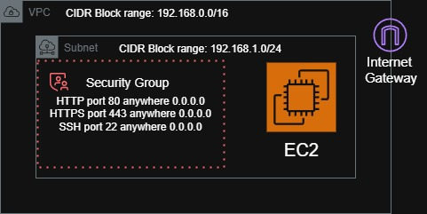
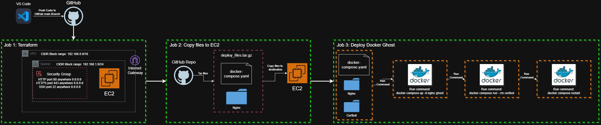

# 🚀 Neo Technologies – DevSecOps Assessment (Ghost CMS Deployment)

This repository contains a secure, automated infrastructure deployment of [Ghost CMS](https://ghost.org/) using **Terraform**, **Docker**, and **GitHub Actions**. It is designed according to DevSecOps best practices, including:

- Infrastructure as Code (IaC) via Terraform
- Containerized Ghost CMS deployment on AWS EC2
- CI/CD automation using GitHub Actions
- Static Application Security Testing (SAST) using Semgrep
- Slack integration for real-time vulnerability notifications

---

## 🧱 Architecture Overview

<p align="center">
  
</p>

- AWS VPC with public subnet
- EC2 instance (Ubuntu) provisioned in the Frankfurt region (`eu-central-1`)
- Docker installed via `user_data.sh`
- Ghost CMS container auto-started on port `80:2368`
- Security group allowing HTTP, HTTPS, and SSH
- Semgrep runs on pull requests and pushes to scan Terraform for security issues

> Note: The security groups are placed on inbound rules HTTP, HTTPS and SSH for destination "Anywhere 0.0.0.0" for this assessment for visibility purposes. The best practice for security is to place a range of IPs that are allowed access to the EC2.

---

## 📁 Folder Structure

```bash
Neo_Technologies_Assessment/
│
├── .github/workflows/       # GitHub Action workflows
│   ├── deploy.yaml          # Infrastructure deployment pipeline
│   ├── terraform-scan.yaml        # Semgrep scan on Terraform
│   └── semgrep.yml          # Semgrep CI scan setup
│
├── Diagrams/
│   └── Ghost_Architecture.drawio   # Network architecture diagram (Draw.io)
│   └── Ghost_Architecture.jpg   # Network architecture diagram (JPG)
│
├── terraform/               # Terraform infrastructure files
│   ├── main.tf              # Main infra configuration
│   ├── variables.tf         # Input variables
│   ├── outputs.tf           # Public IP output
│   └── user_data.sh         # Docker & Ghost CMS install script
│
└── README.md                # Project documentation
```

> Note: For the Semgrep, we can have only 1 workflow file the "semgrep.yml" instead of 2 (terraform-scam.yaml) but kept them both for separation of concerns.

### 🧪 CI/CD: deploy.yaml Workflow

```bash
name: Deploy Terraform Infra

on:
  push:
    branches: [main]

jobs:
  terraform:
    name: Terraform Plan & Apply
    runs-on: ubuntu-latest
    defaults:
      run:
        working-directory: terraform

    steps:
      - name: Checkout code
        uses: actions/checkout@v3

      - name: Set up Terraform
        uses: hashicorp/setup-terraform@v2
        with:
          terraform_version: 1.6.0

      - name: Terraform Init
        run: terraform init

      - name: Terraform Plan
        run: terraform plan -var="key_name=${{ secrets.EC2_KEY }}"

      - name: Terraform Apply
        run: terraform apply -auto-approve -var="key_name=${{ secrets.EC2_KEY }}"

    env:
      AWS_ACCESS_KEY_ID: ${{ secrets.AWS_ACCESS_KEY_ID }}
      AWS_SECRET_ACCESS_KEY: ${{ secrets.AWS_SECRET_ACCESS_KEY }}
      AWS_DEFAULT_REGION: ${{ secrets.AWS_DEFAULT_REGION }}
```

### Terraform folder structure explanation:

main.tf: contains the code for the whole infrastructure with all the needed components. At the end when creating the EC2 instance, it mounts the "user_data.sh" script to the EC2 User data as script code and install the needed libraries.

variables.tf: contains all the global variables that can be used throughout the main.tf file like vpc-id.

outputs.tf: displays the ec2-public-ip after it is created when running the code to show that the pipeline was successful.

## GitHub Repo Setup (Secrets + Slack WebHook + Semgrep token)

The GitHub secrets that we will need:

| Secret Name                | Description                     |
| -------------------------- | ------------------------------- |
| `AWS_ACCESS_KEY_ID`        | AWS access key                  |
| `AWS_SECRET_ACCESS_KEY`    | AWS secret access key           |
| `AWS_DEFAULT_REGION`       | Region (e.g., eu-central-1)     |
| `EC2_KEY`                  | EC2 key name in AWS             |
| `SEMGREP_APP_TOKEN`        | Semgrep auth token              |
| `SLACK_WEBHOOK_URL`        | Slack channel webhook URL       |
| `EC2_USER` *(bonus)*       | SSH user (usually `ubuntu`)     |
| `EC2_KEY_DEPLOY` *(bonus)* | Private key content for SCP/SSH |

### How to get the Slack WebHook URL:

First we access this link to access [Slack API](https://api.slack.com/apps) webpage and click on "Create New App" > From Scratch. Give it a title and connect it to your slack workspace. 

Next, navigate to "Incoming Webhooks" in the sidebar and Turn on the button to activate the Incoming webhooks. Scroll down and click "Add New Webhook". Connect it to a channel in your slack workspace then continue. 

After doing these steps, you will be able to see a new webhook that got created, copy it and paste it in GitHub Secrets.

| Slack WebHook API                           | Slack WebHook  Channel                      |
| --------------------------------------- | ------------------------------------- |
|  |  |


### How to get the Semgrep Token into the GitHub Secrets:

First, navigate to [Semgrep](https://semgrep.dev/) website and signup for free. The website will ask you to link it to your GitHub account, make sure to download anything neccessary. Finish all the steps then navigate to "Projects" section in the sidebar.

On the top-right corner, click on "Scan new project" > CI/CD > GitHub Actions. Choose your GitHub repo that you want and next to it click "Add CI jobs".

| Scan new Projects                           | CI/CD                      |
| --------------------------------------- | ------------------------------------- |
| %20Scan%20new%20project.png) | %20CICD.png) |

| GitHub Actions                           | Add CI jobs                      |
| --------------------------------------- | ------------------------------------- |
| %20GitHub%20Actions.png) | %20Add%20CI%20jobs.png) |

After that, make sure to click on the second option "Commit CI configuration file". This will create the "semgrep.yml" file and push it to the GitHub repo automatically for CI scans. It will take a little until the scanning is finished then then token will be added to the GitHub repository secrets automatically. 

| Commit CI configuration file                           | Scan Complete                      |
| --------------------------------------- | ------------------------------------- |
| %20Commit%20CI%20configuration%20file.png) | %20Scan%20Complete.png) |

After Pushing the code to the main repo and the code being deployed, we can access the container using the [Public IP](http://3.70.53.72) which will display a screen similar to the below picture.


Slack Notification for CI Semgrep:


# Bonus Work

In this section, there are some modifications to the deploy.yaml file in the workflows folder and added extra configurations. The purpose of these modifications is to add a certbot certificate to the container so it will be accessed through HTTPS for better security and using a free domain name to access the website instead of using the public IP of the EC2 instance. 

### GitHub Secrets modification:

These secrets should be added to the repo other than the secrets mentioned in the previous section:

- EC2_USER (ubuntu)
- EC2_KEY_DEPLOY (the actual value of the key file which will be used for scp and ssh)

### This is the new folder structure

> The folders certbot, nginx and docker-compose.yaml file with all their configure will be copied to the EC2 to run as containers and generate a certbot certificate for the container.

```bash
Neo_Technologies_Assessment/
│
│   docker-compose.yaml
│   README.md
│
├───.github
│   └───workflows
│           deploy.yaml
│           semgrep.yml
│           terraform-scan.yml
│
├───certbot
│   ├───conf
│   └───www
│
├───nginx
│   │   startup.sh
│   └───templates
│           full.conf
│           http.conf
│
└───terraform
        main.tf
        outputs.tf
        user_data.sh
        variables.tf
```

To be able to achieve the result of accessing the website through a domain, we need first to create a hostname. Navigate to [NoIP.com](https://www.noip.com/) and signup. 

After signing up, navigate to "DDNS & Remote Access" > No-IP Hostnames > Create Hostname. 


Enter a hostname and choose one of the free domains available. As for the IP Target, leave it as default IP for now until we aquire the EC2 public IP then we can change it here.

**After getting the hostname, Update the following files with your domain:**

   - `docker-compose.yaml`

   - `nginx/startup.sh`

   - `nginx/templates/http.conf`

   - `nginx/templates/full.conf`


   > Ensure `proxy_pass http://ghost:2368;` matches container service name & port

**NOTE: Make sure to copy the EC2 public IP and paste it to noip in the hostname before the 3rd job in the workflow is running so the certbot certificate will be generated**

## 🎨 Deployment Result

- Ghost CMS running at public IP or domain on HTTPS
- Slack notification sent for scan results
- Fully automated setup & teardown

## Deployment Diagram

